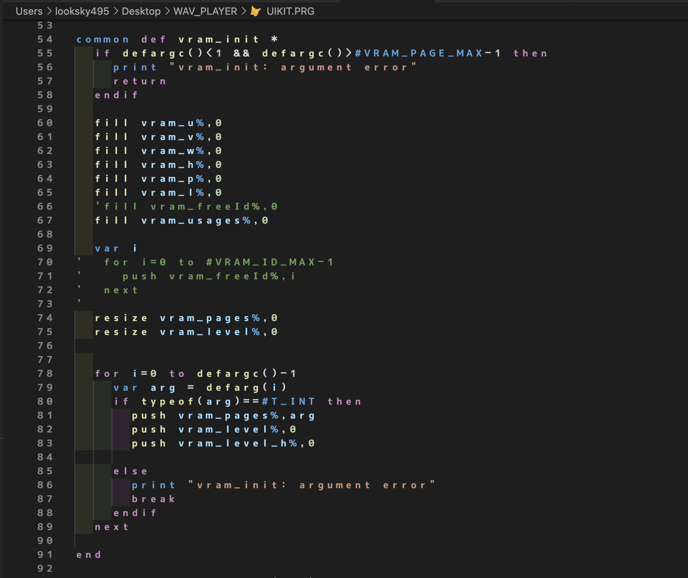
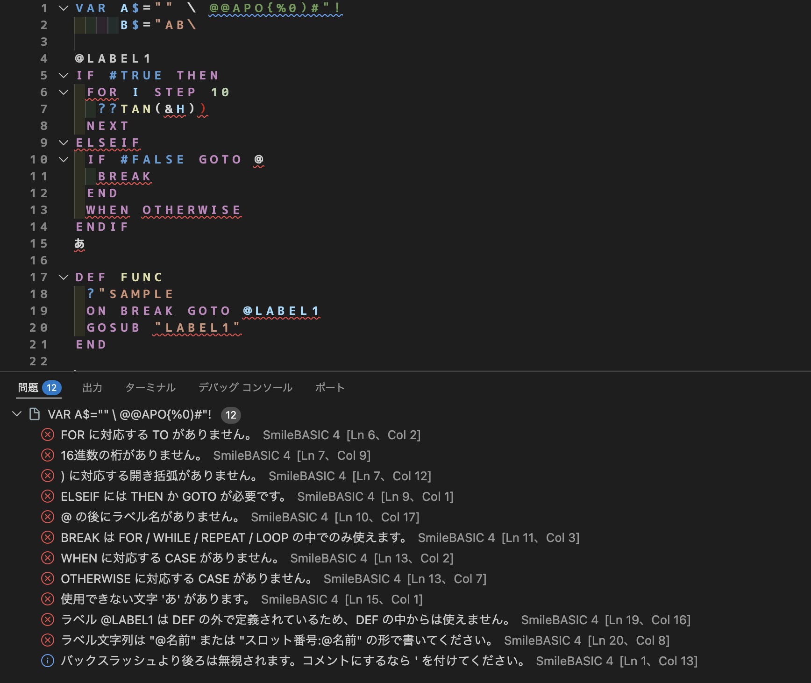

# プチコン4 SmileBASIC 4 — VSCode 拡張機能

Nintendo Switch 用プログラミングソフト「プチコン4 SmileBASIC」の言語 **SmileBASIC 4** に、
VSCode 上での構文ハイライトと構文チェックを提供します。

## できること

### 構文ハイライト



#### 配色

この拡張機能は色そのものを指定せず、使用中のカラーテーマの配色をそのまま参照します。

### 構文チェック



チェックは設定 `smilebasic4.diagnostics.enable` で切れます。

## 使い方

`.prg` を開くと自動で有効になります。
別の拡張子を使っている場合は VSCode の設定に関連付けを足してください。

```jsonc
// settings.json
"files.associations": {
  "*.txt": "smilebasic4"
}
```

## 開発

```sh
npm install
npm run build   # TypeScript のコンパイル → TextMate 文法の生成
npm test        # 146 件のテスト
```

VSCode でこのフォルダを開いて **F5** を押すと、拡張機能を読み込んだ別ウィンドウが起動します。
`examples/sample.prg` を開けば、色付けと構文チェックの結果を目で確認できます。

## 構成

```
src/
  language/          言語の知識をまとめた「単一の情報源」
    keywords.ts        予約語 44 語（制御構文・演算子・その他に分類）
    builtins.ts        組み込み命令・関数 302 語
    blocks.ts          ブロック構造の対応表（IF↔ENDIF など）
    shorthands.ts      記号の略記の表（? / T? / ??）
  grammar/
    grammar.ts         TextMate 文法の組み立て（language/ の表を参照）
  parser/
    lexer.ts           字句解析
    diagnostic.ts      指摘 1 件を表す型
    diagnostics.ts     構文チェック（vscode に依存しない）
  tools/
    build-grammar.ts   syntaxes/*.tmLanguage.json の書き出し
  extension.ts       VSCode との接続（診断の登録と更新のみ）
syntaxes/
  smilebasic4.tmLanguage.json   ★自動生成。直接編集しないこと
```

### どこを直せばよいか

| やりたいこと | 直す場所 |
| --- | --- |
| コマンドを追加・修正する | `src/language/builtins.ts` の配列だけ |
| 予約語の分類を変える | `src/language/keywords.ts` |
| 新しいブロック構文に対応する | `src/language/blocks.ts` に 1 行足す |
| 記号の略記を追加する | `src/language/shorthands.ts` に 1 行足す |
| 色付けの規則を変える | `src/grammar/grammar.ts` |
| チェック項目を増やす | `src/parser/diagnostics.ts` |

キーワードの一覧は `src/language/` に 1 か所だけ置き、そこから TextMate 文法を生成しています。
組み込み命令が 302 語あるため、生成後の正規表現は 1 行 2000 文字を超えます。
これを手で書くと差分を読めなくなるうえ、構文チェック側との二重管理になるため、
**`syntaxes/smilebasic4.tmLanguage.json` は編集せず、必ず `npm run build` で作り直してください。**
（生成物はコミットします。clone しただけで動き、`vsce package` がそのまま通るようにするためです。）

### テスト

| ファイル | 見ているもの |
| --- | --- |
| `src/test/lexer.test.ts` | 字句解析（コメント・リテラル・略記・行継続） |
| `src/test/diagnostics.test.ts` | 構文チェックの検出と誤検出 |
| `src/test/grammar.test.ts` | 文法定義の不変条件（分類の重複、生成漏れ） |
| `src/test/highlight.test.ts` | 生成した文法を実際の Oniguruma に通した色付け結果 |

## 言語仕様の出典

実装は公式リファレンスに基づいています。

- [言語仕様](https://sup4.smilebasic.com/doku.php?id=reference:%E8%A8%80%E8%AA%9E%E4%BB%95%E6%A7%98)
- [演算子](https://sup4.smilebasic.com/doku.php?id=reference:%E6%BC%94%E7%AE%97%E5%AD%90)
- [制御命令](https://sup4.smilebasic.com/doku.php?id=reference:%E5%88%B6%E5%BE%A1%E5%91%BD%E4%BB%A4)
- [リファレンス目次](https://sup4.smilebasic.com/doku.php?id=reference:top)

## おことわり

このプログラムは人間の指示に基づき、主に AI によって作成されています。使用モデルはコミットメッセージを参照してください。 

## ライセンス

MIT
